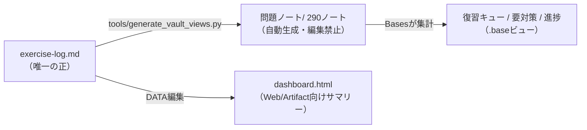

---
tags:
  - 設計
---

# 学習データ × Obsidian 保管庫 — 設計書

この保管庫は、演習データを**3層**で扱う。データは一方向にしか流れない。

## 第1層 — 正: `exercise-log.md`

全290問の理解度・日付・メモを持つ唯一のマスター。**記録の更新はここにしか書かない。** 秘書（Claude）が○/△/✕の報告を受けて更新し、commit/pushする。

## 第2層 — 派生: `問題ノート/`（1問=1ノート）

`tools/generate_vault_views.py` が演習ログを解析して自動生成する290個のノート。各ノートはfrontmatterプロパティ（id / subtitle / subject / chapter / grade / solved / due / reps / flagged）を持ち、履歴メモと該当する[[型カード① 差額原価の意思決定|型カード]]へのリンクを含む。

- **手で編集しない**（次回生成で消える）。全ノートに警告calloutあり
- 再生成は `python3 tools/generate_vault_views.py` 1コマンド（フォルダごと作り直す冪等動作）
- なぜノート化するか: Obsidian Basesはノートのプロパティしか集計できない。表1枚のままではビューが張れないため、ログを「Basesが読める形」に射影している。二重管理にならないのは、この層が**書き込み禁止の純粋なキャッシュ**だから

## 第3層 — ビュー: `.base` ファイル3枚

| ファイル | 何に答えるか | 主なビュー |
|---|---|---|
| [[復習キュー.base]] | **今日どれを解くか** | ✕最優先／期限到来△（古い順）／工原だけ |
| [[要対策.base]] | **どこが沼か** | 章別／復習回数の多い順 |
| [[進捗.base]] | **全体はどこまで来たか** | 章別（🟢🟠🔴）／科目別／残り△ |

期限判定（`due <= today()`）はBasesが開くたびに再計算するので、ビュー自体の更新は不要。

## 知識層（手書き・不変）

[[ホーム]]・型カード①〜⑥・[[論点マップ.canvas]] は人間（と秘書）が育てる手書き層。自動生成の対象外。

## 更新サイクル

1. 問題を解く → 秘書が `exercise-log.md` を更新
2. セッション末に秘書が `python3 tools/generate_vault_views.py` を実行
3. commit / push → Macで `git pull` すればObsidianの全ビューが最新化

## この設計を選んだ理由

- **単一の正**: 手書きの複製を一切作らない。生成物はいつでも捨てて作り直せる（可逆）
- **拡張1行**: 新しい問題はログに1行足すだけでノートもビューも自動で追随する
- **ビューの追加が自由**: 新しい切り口（例: 「重要度A だけ」）は `.base` を1枚足すだけ。生成器もログも触らない
